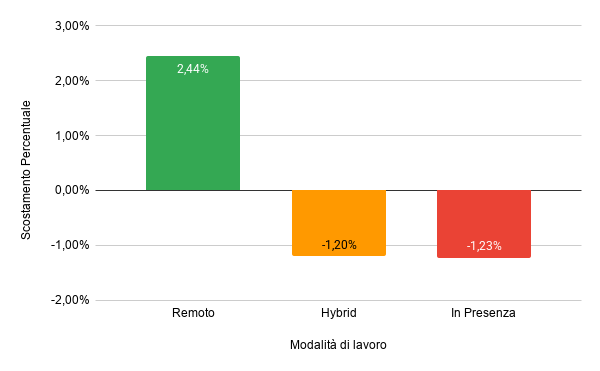

# Premium del Lavoro Remoto: Vantaggio Salariale
L'obiettivo di questa analisi è verificare se la modalità di lavoro da remoto offra un vantaggio economico reale rispetto alle modalità ibride o in presenza, quantificando il "premio" salariale per chi lavora a distanza.

# Processo Tecnico

* **Query SQL**: Ho calcolato la media salariale per ogni modalità di lavoro e, attraverso una Subquery, ho determinato lo Scostamento Percentuale di ogni categoria rispetto alla media generale dell'intero dataset. Questo permette di capire non solo chi guadagna di più, ma di quanto si discosta dalla norma del mercato. (Il codice SQL è disponibile nel file premium_remoto.sql).
* **Metriche**: Ho incluso il numero di casi per convalidare la solidità del dato, che risulta distribuito quasi equamente tra le tre categorie (circa 83.000 record per gruppo).

# Visualizzazione
Per questa analisi ho scelto un grafico a colonne divergenti su Google Sheets per rendere immediato il confronto con la media:

* **Grafico**: Scostamento Percentuale della RAL rispetto alla Modalità di Lavoro.
* **Indicatori Visivi**: La colonna verde indica il vantaggio del Full Remote (+2,44%), mentre le colonne arancione e rossa mostrano come l'ibrido (-1,20%) e la presenza (-1,23%) si collochino al di sotto della media generale.
* **Etichette Dati**: Ho inserito le percentuali esatte direttamente all'interno delle colonne per garantire la massima leggibilità del gap salariale.
  
### Grafico: Differenza percentuale dello stipendio per modalità di lavoro

# Insight principali

* **Il "Remote Premium"**: Chi lavora interamente da remoto percepisce mediamente €149.279,59, superando di oltre €5.000 i colleghi in presenza.
* **Uniformità del mercato fisico**: Il dato più sorprendente è che tra lavorare in ufficio e farlo in modalità ibrida non c'è praticamente differenza, lo scarto è di appena €37. Questo dimostra che il vero salto economico non avviene con la flessibilità parziale, ma solo quando si passa al remoto totale, che è l'unica modalità realmente premiata dal mercato con un aumento significativo.
  
#  Conclusione
L'analisi ha confermato che il lavoro da remoto offre un vantaggio economico reale e misurabile. Non era scontato, avrebbe potuto essere il contrario, con le aziende che premiano chi si presenta fisicamente in ufficio. Invece i dati mostrano chiaramente che il Full Remote si posiziona al +2,44% rispetto alla media generale del dataset. Da notare anche che ibrido e presenza sono praticamente identici (-1,20% vs -1,23%), il che suggerisce che il mercato non fa distinzione tra le due modalità fisiche, ma premia solo chi lavora completamente da remoto. Questo probabilmente perché il Full Remote permette alle aziende di accedere a talenti altamente specializzati indipendentemente dalla loro posizione geografica, spingendole ad offrire RAL più competitive.
