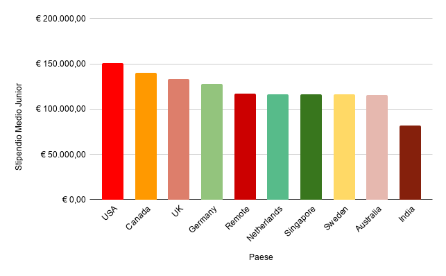

# Hub Talenti Junior: Classifica Salariale per Paese
L'obiettivo di questa analisi è identificare le aree geografiche che offrono le migliori condizioni economiche d'ingresso per i profili Junior (0-2 anni di esperienza) all'interno dei 10 paesi campionati nel dataset.

# Processo Tecnico
Ho gestito l'estrazione e la pulizia dei dati per isolare i profili entry-level:
* **Query SQL** : Ho interrogato il dataset filtrando per l'esperienza lavorativa (experience_years <= 2). Ho rinominato la colonna Location in Paese direttamente nel codice per garantire una nomenclatura chiara fin dall'origine. 
(Il codice è disponibile nel file: talenti_junior.sql).
* **Semplificazione del dato**: Inizialmente l'analisi prevedeva l'incrocio tra Paesi e Settori, ma la visualizzazione risultava troppo frammentata. Ho scelto quindi di aggregare i dati solo per Paese per fornire una visione strategica "macro" più immediata.
* **Logica di Calcolo**: Ho utilizzato la funzione AVG per determinare lo stipendio medio nazionale, ordinando i risultati in modo decrescente per evidenziare i mercati leader.

# Visualizzazione (Google Sheets)
* **Formattazione condizionale**: Applicata una scala di colori dal bianco al verde sulla colonna dello stipendio medio per rendere immediatamente percepibile la gerarchia retributiva tra i diversi paesi.
* **Grafico a barre**: Ho creato un grafico basato sui risultati aggregati, ordinato per RAL decrescente.

### Grafico: Stipendio Medio Junior rispetto a Paese

# Insight principali

* **Leader di Mercato**: Gli USA si confermano l'hub più remunerativo per i Junior con una media di circa €151.173, seguiti dal Canada (€139.879).
* **Panorama Europeo**: Il Regno Unito (€133.372) e la Germania (€127.876) rappresentano le destinazioni top in Europa, staccando nettamente la media delle altre nazioni europee presenti nel dataset.
* **Il caso India**: L'India chiude la classifica con una media di circa €81.491. Nonostante sia il valore più basso registrato nel dataset, questo dato va rapportato al contesto economico locale: una RAL di questo livello può comunque rappresentare un'ottima base di partenza per i talenti del posto. Questo rende il mercato indiano un'opzione valida e competitiva per le figure junior locali, nonostante il distacco numerico rispetto agli altri paesi analizzati.
* **Analisi Geografica**: I dati mostrano un netto vantaggio competitivo dei mercati nordamericani, dove la remunerazione per i nuovi talenti è mediamente superiore rispetto alle principali economie europee presenti nel dataset.

# Conclusione
I dati mostrano un mercato chiaramente diviso: se l'obiettivo è lo stipendio più alto possibile, USA, Canada e UK restano le mete imbattibili per un Junior. È interessante però notare la stabilità del gruppo centrale: tra Europa, Australia, Singapore e lavoro Remote, la differenza è minima. Questo significa che oggi un giovane talento può ottenere quasi lo stesso stipendio lavorando da casa rispetto a trasferirsi in contesti internazionali molto costosi, rendendo il fattore geografico molto meno decisivo che in passato.
