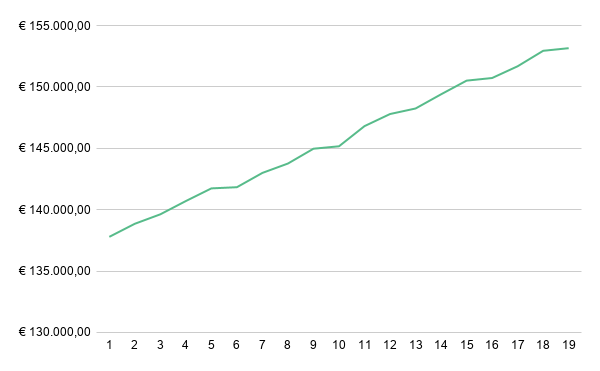

# Skill Overload: Quantità vs Valore di Mercato
L'obiettivo di questa analisi è verificare se esiste un limite massimo di competenze oltre il quale lo stipendio smette di crescere in modo significativo, identificando la soglia di efficienza per un professionista.

# Processo Tecnico
* **Query SQL**: Ho messo in relazione il numero di competenze (skills_count) con la media salariale (Stipendio_Medio) e il volume di professionisti per ogni fascia. Ho utilizzato GROUP BY per aggregare i dati e ORDER BY per visualizzare la progressione. (Il codice completo è disponibile nel file analisi_skills.sql).
* **Validazione Statistica**: Ho inserito il conteggio dei professionisti (Numero_Professionisti) per assicurarmi che ogni fascia fosse statisticamente rilevante e che le medie non fossero falsate da pochi casi isolati.

# Visualizzazione
Su Google Sheets ho scelto un grafico a linee per evidenziare il trend:

* **Pendenza della curva**: La linea mostra una crescita costante e decisa fino alle 15 competenze, toccando una media di €150.513.
* **Fase di saturazione**: Superata questa soglia, la curva si appiattisce. Tra le 15 e le 19 skill, lo stipendio aumenta di soli €2.643 totali,
* **Formattazione**: Ho mantenuto la scala cromatica bianco-verde sulla tabella per evidenziare visivamente il passaggio verso i massimi salariali.

  # Grafico: Correlazione tra numero di Skill e Stipendio Medio
  
  

 # Insight principali

* **Rendimento Decrescente**: Il mercato premia generosamente l'acquisizione di nuove skill fino a 15. Oltre questo numero, il valore di ogni competenza aggiuntiva crolla drasticamente.
* **Volume di mercato:** La tabella mostra una distribuzione molto uniforme (circa 13.000 professionisti per ogni livello di skill), segno che il dato è solido e non influenzato da anomalie statistiche.
  
# Conclusione
Conclusione
Dall'analisi emerge un limite di efficienza molto chiaro: fino a 15 competenze ogni nuova skill si traduce in un aumento reale di stipendio. Dopo questa soglia, il guadagno diventa minimo rispetto allo sforzo richiesto. Per un professionista è più intelligente fermarsi a una solida base di 15 skill e poi spostare il focus su altri fattori, come le certificazioni (visto l'alto ROI nell'Analisi 3) o la specializzazione verticale.
