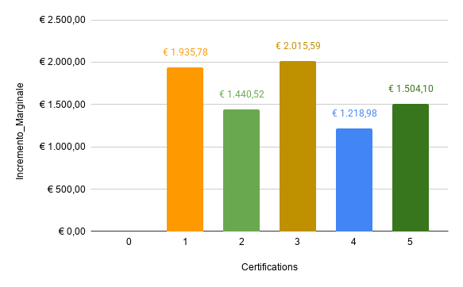

# ROI delle Certificazioni: Analisi dell'Incremento Marginale
L'obiettivo di questa analisi è calcolare il Ritorno sull'Investimento (ROI) delle certificazioni, misurando quanto aumenta effettivamente la RAL media per ogni titolo aggiuntivo ottenuto.
# Processo Tecnico
Ho utilizzato SQL per creare un confronto diretto tra i diversi livelli di certificazione:

* **Query SQL**: Ho calcolato la media salariale (Avg_Salary) raggruppata per numero di certificazioni. Per ottenere il valore reale di ogni "step", ho utilizzato la Window Function LAG(), che mi ha permesso di calcolare l'Incremento Marginale sottraendo la media del livello precedente a quello attuale (il codice SQL completo è disponibile nel file: roi_certificazioni.sql).
Pulizia dati: Ho arrotondato i valori a due decimali tramite ROUND() per garantire una rappresentazione monetaria precisa dell'incremento tra un livello e l'altro.

# Visualizzazione
Su Google Sheets ho creato un sistema visivo per individuare il punto di massimo rendimento della formazione:

* **Formattazione condizionale**: Ho applicato una scala di colori sulla colonna Avg_Salary partendo dal bianco per il valore minimo fino al verde scuro per il valore massimo, rendendo immediata la percezione della crescita salariale.
* **Grafico a barre colorate**: Ho rappresentato l’Incremento Marginale. Ogni barra indica il valore monetario aggiunto da ogni singola certificazione.
* **Etichette dati**: Ho inserito i valori esatti sopra ogni barra per rendere immediata la lettura del profitto aggiuntivo.
  

# Insight principali

* **Il picco di valore**: Il salto di qualità maggiore si ottiene passando da 2 a 3 certificazioni, con un incremento record di €2.015,59. È questo il punto in cui l'investimento in formazione rende di più.
* **Costanza dei primi step**: Anche la prima certificazione ha un impatto fortissimo, portando subito un aumento di €1.935,78.
* **Rendimento stabile**: Tra la 4ª e la 5ª certificazione la crescita continua in modo solido (+€1.504,10). Nell'intervallo analizzato (0-5 certificazioni), ogni titolo aggiuntivo continua ad aggiungere valore reale.

# Conclusione
I dati mostrano che il mercato premia la formazione fin da subito: già la prima certificazione garantisce un salto di quasi €2.000. Tuttavia, il vero "punto d'oro" è la terza, che segna l'incremento più alto in assoluto (+€2.015). Per un Junior, la strategia migliore è non fermarsi al primo titolo ma puntare almeno alla terza certificazione: è qui che si ottiene il massimo ritorno economico rispetto allo sforzo di studio.
