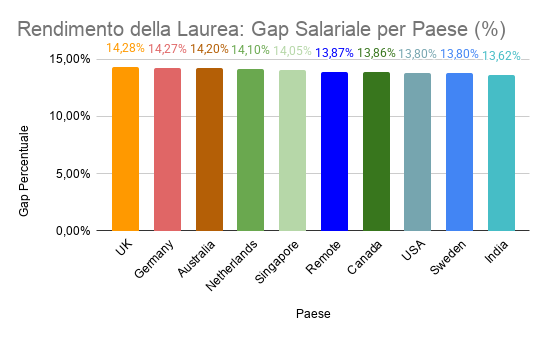

# Analisi Education Premium: Laurea vs Diploma
L'obiettivo di questa analisi è rispondere a una domanda pratica: quanto incide economicamente la laurea sulla RAL rispetto a un diploma? 
Ho analizzato il vantaggio salariale nei 10 paesi del dataset, calcolando lo scostamento percentuale tra le due categorie.

 # Processo Tecnico
Ho gestito l'elaborazione su SQL per avere un dato pulito da importare su Sheets:

* **Query SQL**: Ho usato una CTE (EducationSalary) per dividere i profili in due macro-gruppi: Laureati (Bachelor, Master, PhD) e Diplomati (High School, Diploma).
* **Logica di Calcolo**: Ho calcolato le medie con AVG(CASE WHEN...) e generato il gap direttamente nel codice con la formula: ROUND(((avg_degree - avg_diploma) / avg_diploma) * 100, 2) AS Gap_Percentuale.
* **Pulizia**: Ho filtrato i valori NULL su avg_diploma e avg_degree per escludere i paesi in cui non erano presenti dati sufficienti per entrambe le categorie di istruzione, garantendo così che il gap percentuale fosse calcolato solo su confronti completi e affidabili.
I risultati sono stati poi ordinati in modo decrescente sul Gap Percentuale per mettere immediatamente in evidenza i paesi con il ritorno economico maggiore.

# Visualizzazione
Su Google Sheets, ho lavorato sulla leggibilità del dato:

* **Formattazione condizionale**: Applicata una scala di colori dal bianco (valore minimo) al verde (valore massimo) sulla colonna del Gap, per evidenziare visivamente l'intensità del ritorno economico e creare una gerarchia immediata dei dati.
* **Grafico**: Un grafico a barre che mostra il gap percentuale per ogni paese, ordinato dal valore più alto al più basso, con le etichette dati visibili sopra ogni barra per una lettura immediata!

  #### Grafico: Premio Salariale per Paese (%)
  

  ## Insight principali
* **Top 3 mercati**: Il Regno Unito guida la classifica con un gap del 14,28%, seguito quasi a pari merito da Germania (14,27%) e Australia (14,20%). In questi paesi, l'investimento accademico ha il ROI più alto.
* **Il caso USA**: È un dato curioso. Sebbene gli Stati Uniti offrano la RAL più alta in assoluto per i laureati (€190.918), il gap percentuale è tra i più bassi (13,80%). Questo indica che il mercato USA paga molto bene anche chi possiede solo un diploma, rendendo il vantaggio "relativo" della laurea meno marcato rispetto all'Europa.

  # Conclusione
Il gap salariale è estremamente stabile in tutti i 10 paesi analizzati, oscillando tra il 13,62% e il 14,28%. Questo dimostra che il valore economico della formazione superiore è riconosciuto in modo uniforme nei mercati esaminati: la laurea conviene ovunque, con differenze minime tra un paese e l'altro.

  
